# NESTJS FLOW

End to end build a project with NestJS.
This series demo is just for purpose learning or practice NestJS.

<details>
<summary>All branches of projects</summary>

1. Init project: Controller, services, modules
2. Database, typeorm
3. Auth with passpord, jwt
4. Error handling & data validation
5. Serializing response with interceptors
6. Database relationship
7. Unit testing, integration testing
8. End to end testing
9.  Upload file to Amazon s3(Public bucket)
10. Managing private files with amazon S3 (Private bucket)
11. Elastic search
12. Implement refresh token jwt
13. Explore SQL database with indexes, transactions, array data type
14. Exploring idea of microservices (TCP Layer, RabbitMQ, gRPC framework)
15. Pattern Command-Querry-Responsibility-Segregation (CQRS)
16. Storing JSON with PostgresSQL & TypeORM
17. Implementing in-memory cache to increase the performance
18. Cache with Redis. Running the app in a Nodejs cluster

</details>

---

<details>

<summary>Table of content</summary>

- [NESTJS FLOW](#nestjs-flow)
  - [1. Init project](#1-init-project)
    - [Installation](#installation)
    - [Bootstrap projects](#bootstrap-projects)
    - [Using variable environment (.env)](#using-variable-environment-env)
    - [Modules](#modules)
      - [Post modules](#post-modules)
  - [2. TypeORM](#2-typeorm)
    - [Post modules](#post-modules-1)
    - [Documentation with Swagger/Open API](#documentation-with-swaggeropen-api)
  - [3. Auth](#3-auth)
    - [User](#user)
    - [Auth](#auth)
      - [Installation](#installation-1)
      - [Auth service](#auth-service)
      - [Auth controller](#auth-controller)
      - [Complete authentication part](#complete-authentication-part)
  - [4. Error handling](#4-error-handling)
    - [Exception filter](#exception-filter)
    - [Validation](#validation)
  - [5. Serialization](#5-serialization)
    - [Exclude option](#exclude-option)
    - [Expose option](#expose-option)
    - [Issues with using @Res() decorator](#issues-with-using-res-decorator)
  - [6. Database relationship](#6-database-relationship)
  - [7. Testing](#7-testing)
  - [8. End to end testing (e2e)](#8-end-to-end-testing-e2e)
    - [Introduction](#introduction)
    - [Test root folder](#test-root-folder)
    - [Develop](#develop)
    - [Other modules](#other-modules)
  - [9.1  Web service AWS S3](#91--web-service-aws-s3)
    - [Create IAM user](#create-iam-user)
    - [Create AWS S3 bucket](#create-aws-s3-bucket)
    - [Update variables enviroments](#update-variables-enviroments)
    - [Create FileModule](#create-filemodule)
  - [9.2  Private bucket AWS](#92--private-bucket-aws)
    - [Setting up AWS S3](#setting-up-aws-s3)
    - [Update FileModule for Private bucket](#update-filemodule-for-private-bucket)
    - [Fetch files and Generating presigned URLs from AWS S3 as  a stream](#fetch-files-and-generating-presigned-urls-from-aws-s3-as--a-stream)
  - [10. Elasticsearch](#10-elasticsearch)
  - [11. Refresh token](#11-refresh-token)
    - [Implementation in Nestjs](#implementation-in-nestjs)
    - [Creating an endpoint that uses the refresh token](#creating-an-endpoint-that-uses-the-refresh-token)
    - [Improving the log-out flow](#improving-the-log-out-flow)
  - [12. Improve performance of databases](#12-improve-performance-of-databases)
  - [13. Nestjs microservices](#13-nestjs-microservices)
  - [14. Command Query Responsibility Segregation (CQRS Pattern)](#14-command-query-responsibility-segregation-cqrs-pattern)
  - [15.](#15)
  - [16.](#16)
  - [References](#references)


</details>


---

When we work with Nodejs in big projects, the project structure become so important.
So if you love typescript, [NestJS](https://nestjs.com/) will help you resolve this problem.

So what is NestJS?

Nest (NestJS) is a progressive Nodejs framework (open-source) for building efficient, scalable, testable. It is built with and fully supports TypeScript  and combines elements of OOP (Object Oriented Programming), FP (Functional Programming), and FRP (Functional Reactive Programming). It use many strong design pattern: Dependency injection, MVC, micro services, CQRS pattern ...

Nest has many features out of box to help you make your project become ready-production quickly.


**Check [Nest](https://nestjs.com/) for more information.**

Now we will start with a simple REST API project with NestJS from basic to advance.

Each big step will separate by each branch of git.

## 1. Init project


<details>
<summary>Click to expand section</summary>

Check the code at branch [1-init-project](https://gitlab.com/tienduy-nguyen/nestjs-flow/-/tree/1-init-project)

### Installation

Install [Nest CLI](https://docs.nestjs.com/cli/overview)
  ```bash
  $ yarn global add @nestjs/cli
  $ nest new project-name
  ```

  or alternatively, to install the TypeScript project wiht **Git**:
  ```bash
  $ git clone https://github.com/nestjs/typescript-starter.git project
  $ cd project
  $ npm install
  $ npm run start
  ```

  Check [Nestjs documentations for more details](https://docs.nestjs.com/)

**Start coding**
### Bootstrap projects
- Init project with **Nest CLI**
  ```bash
  $ nest new nestjs-flow
  $ cd nestjs-flow
  ```

  When all done, we will have a structure project:

  ```tree
    .
  ├── nest-cli.json
  ├── package.json
  ├── README.md
  ├── src
  │   ├── app.controller.spec.ts
  │   ├── app.controller.ts
  │   ├── app.module.ts
  │   ├── app.service.ts
  │   └── main.ts
  ├── test
  │   ├── app.e2e-spec.ts
  │   └── jest-e2e.json
  ├── tsconfig.build.json
  ├── tsconfig.json
  └── yarn.lock
  ```

  Check the [Nest documentation](https://docs.nestjs.com/), you will have a very good explain about structure, about each files & understand how it works.

  **Note:** when you create project with **Nest cli**, it will be automatically include a file `.git` in the root folder. Consider delete it with `rm -rf .git` if you have already another `.git`.

  **Note2:** if you create Nestjs as a subfolder in your project (as microservice eg), you will have some problem with **eslint** syntax. **To fix that**, update `tsconfigRootDir: __dirname` in `.eslint.js` file

  ```diff
  //.eslintrc.js
    parserOptions: {
      project: 'tsconfig.json',
  +  tsconfigRootDir: __dirname,
      sourceType: 'module',
    },
  ```

- Start server
  Run `yarn start:dev` to start server. Check all scripts availables in `package.json` file.

- Custom port server
  Default port of server nest js: `3000`, you can change it as you cant in `main.ts`. Here, I use port `1776`:
  ```ts
  //main.ts
  import { NestFactory } from '@nestjs/core';
  import { AppModule } from './app.module';

  async function bootstrap() {
    const app = await NestFactory.create(AppModule);
    await app.listen(1776, () => {
      console.log(`Server is running at http://localhost:1776/`);
    });
  }
  bootstrap();

  ```
### Using variable environment (.env)

If you are familiar with Nodejs, you may be sûre already know `dotenv` package to manage variable environment (secret variable) in `.env` files.

Nest JS also help us to handle that with `@nestjs/config`.

- Install
  Add to the DevDependencies
  ```bash
  $ yarn add -D @nestjs/config
  ```
- Setup
  We will import the `ConfigModule` in `app.modules.ts`:
  ```ts
  //app.module.ts
  import { Module } from '@nestjs/common';
  import { ConfigModule } from '@nestjs/config';

  @Module({
    imports: [ConfigModule.forRoot()],
  })
  export class AppModule {}
  ```
  `ConfigModule` is setup global (for all files) by default. You can customize to more readable:

  ```ts
  // app.module.ts
  ...
  imports: [
    ConfigModule.forRoot({
      isGlobal: true,
      envFilePath: '.env',
    }),
    ...
  ],
  ...
  ```

  Then, when server started, the config will initialize automatically.
- How it works
  The principe of `@nest/config` is the same as `dotenv`. That means we can use `process.env` to call the variable.

  ex: in the `.env` file we have:
  ```.env
  DATABASE_USER=test
  DATABASE_PASSWORD=test
  ```
  ==> use `process.env.DATABASE_USER` , `process.env.DATABASE_PASSWORD`

- To better use process.env variables, we will create a global declaration type file.

  Create `node.d.ts` file to declare Nodejs type in `src/common/types` folder and add the variables you declare in your `.env` files

  ```
  # .env file
  SERVER_PORT=1776
  ROUTE_GLOBAL_PREFIX=api
  JWT_SECRET=justanotherkey

  # Typeorm
  TYPEORM_CONNECTION = postgres
  TYPEORM_HOST = postgres
  TYPEORM_USERNAME = postgres
  TYPEORM_PASSWORD = postgres
  TYPEORM_DATABASE = test_db
  TYPEORM_PORT = 5432

  TYPEORM_ENTITIES = [src/modules/**/*.entity.ts]
  TYPEORM_MIGRATIONS=[src/common/migrations/**/*.ts]
  TYPEORM_MIGRATIONS_DIR=src/common/migrations
  ```


  ```ts
  // src/common/types/node.d.ts
  declare namespace NodeJS {
    interface ProcessEnv {
      readonly NODE_ENV: 'development' | 'production' | 'test';
      readonly SERVER_PORT: string;
      readonly TYPEORM_CONNECTION: string;
      readonly TYPEORM_HOST: string;
      readonly TYPEORM_USERNAME: string;
      readonly TYPEORM_PASSWORD: string;
      readonly TYPEORM_DATABASE: string;
      readonly TYPEORM_PORT: string;
      readonly TYPEORM_LOGGING: string;
      readonly TYPEORM_ENTITIES: string;
      readonly TYPEORM_MIGRATIONS: string;
      readonly ROUTE_GLOBAL_PREFIX: string;
      readonly JWT_SECRET: string;
      readonly TWO_FACTOR_AUTHENTICATION_APP_NAME: string;
    }
  }

  ```

  And update your tsconfig.json files:
  ```json
  "typeRoots": [
      "./node_modules/@types",
      "src/common/types"
    ],
  ```

  So, now, each time you call `process.env`, all variables environments will be suggested.


  For more details check on [Nest configuration](https://docs.nestjs.com/techniques/configuration).


### Modules

In the template create by **Nest cli**, there are not many thing to do with. So, we will create a simple api blog to understand easier how NestJS work.

I recommend structure src project as:
```tree
├── src
│   ├── app
│   │   ├── app.controller.spec.ts
│   │   ├── app.controller.ts
│   │   ├── app.module.ts
│   │   └── app.service.ts
│   ├── common
│   │   ├── config
│   │   └── types
│   │       └── node.d.ts
│   ├── main.ts
│   └── modules
│       ├── auth
│       ├── post
│       └── user
```

- **app**: contains all files of app modules
- **common**: contains common or shared files as types, config, migration, data, interface general ...
- **modules**: container where  contains all files of each modules of project. ex: User module, auth module, post module ...

This structure will help you better organize your codes & adapt with principle of Nest framework. If you follow this series, you will understand better why I prefer this structure.

#### Post modules
- Getting started
  Docs of **Nest** is very well structure and excellent explain all techniques & theirs features. So I will not go deep to explain each one.
  When you read my codes, if you don't understand some parts, you can check for more details:
  - [Controllers](https://docs.nestjs.com/controllers): where you put your routes
  - [Providers](https://docs.nestjs.com/providers): services files contains methods to connect with methods of repository (database), it help use to separate business logic from controllers
  - [Modules](https://docs.nestjs.com/modules): combine of controllers & providers to export


- Create `PostService`
  For the first step, we will create a simple Post module. We will not use the database now and we use the fake array instead.
  - Add package `uuid` to create fake **id**
    ```bash
    $ yarn add -D uuid
    ```
  - Create folder `src/modules/post`
  - Create `post.interface.service` for **post model**
    ```ts
    // post.interface.ts
    export interface Post {
      id: string;
      title: string;
      content: string;
    }

    ```
  - Create `src/post/dto`: data transfer object --> to handle data between class data & body request
    ```ts
    // create-post.dto.ts
    export class CreatePostDto {
      title: string;
      content: string;
    }
    ```
    ```ts
    // update-post.dto.ts
    export class UpdatePostDto {
      title?: string;
      content?: string;
    }
    ```
    For **UpdatePostDto** we make nullable for the field to permit update partial.
  - We convert data between class typescript & body request, so we need add package `class-transformer`. **Nest** will help use convert them automatically.
    ```bash
    $ yarn add class-transformer
    ```
  - Create `post.service.ts` from **PostService**
    ```ts
    import { Injectable, NotFoundException } from '@nestjs/common';
    import { CreatePostDto, UpdatePostDto } from './dto';
    import { Post } from './post.interface';
    import { v4 as uuid } from 'uuid';

    @Injectable()
    export class PostService {
      private posts: Post[] = [];

      public async getPosts(): Promise<Post[]> {
        return this.posts;
      }

      public async getPostById(id: string): Promise<Post> {
        const post = this.posts.find((p) => p.id === id);
        if (!post) {
          throw new NotFoundException(`Post with id ${id} not found`);
        }
        return post;
      }

      public async createPost(postDto: CreatePostDto): Promise<Post> {
        const post: Post = {
          ...postDto,
          id: uuid() as string,
        };
        this.posts.push(post);
        return post;
      }
       public async updatePost(id: string, postDto: UpdatePostDto): Promise<Post> {
        const post = this.posts.find((p) => p.id === id);
        if (!post) {
          throw new NotFoundException(`Post with id ${post.id} not found`);
        }
        const updated = Object.assign(post, postDto);
        const postIndex = this.posts.findIndex((p) => p.id === post.id);
        this.posts[postIndex] = updated;
        return updated;
      }

      public async deletePost(id: string): Promise<void> {
        const postIndex = this.posts.findIndex((p) => p.id === id);
        if (postIndex < 0) {
          throw new NotFoundException(`Post with id ${id} not found`);
        }
        this.posts.splice(postIndex, 1);
      }
    }

    ```

    In this post service, we will create the **CRUD** method work with a simple **posts** array.

    **Note**: If you ask what is `@Injectable()` at above of class **PostService**?. It is a class decorator for provider use **Dependency injection (or inversion of injection)**. We will use that to inject easily in controller file.

    For more details, check [Custom providers](https://docs.nestjs.com/fundamentals/custom-providers), [Injection scopes](https://docs.nestjs.com/fundamentals/injection-scopes) & [Circular dependency](https://docs.nestjs.com/fundamentals/circular-dependency) of **Nest**.


- Create `PostController`
  Ok now, we will use the methods of **PostService** in **PostController**
  ```ts
  // post.controller.ts
  import {
    Controller,
    Body,
    Get,
    Post,
    Put,
    Delete,
    Param,
  } from '@nestjs/common';
  import { CreatePostDto, UpdatePostDto } from './dto';
  import { PostService } from './post.service';

  @Controller('posts')
  export class PostController {
    constructor(private readonly postService: PostService) {}

    @Get()
    public async getPost() {
      return await this.postService.getPosts();
    }

    @Get('/:id')
    public async getPostId(@Param('id') id: string) {
      return await this.postService.getPostById(id);
    }

    @Post('/')
    public async createPost(@Body() postDto: CreatePostDto) {
      return await this.postService.createPost(postDto);
    }

    @Put('/:id')
    public async updatePost(
      @Param('id') id: string,
      @Body() postDto: UpdatePostDto,
    ) {
      return await this.postService.updatePost(id, postDto);
    }

    @Delete('/:id')
    public async deletePost(@Param('id') id: string) {
      return await this.postService.deletePost(id);
    }
  }

  ```

  Note:
  - Make sure you use `@Controller('...')` decorator for class **PostController**
  - You can also use [Nest CLI](https://docs.nestjs.com/cli/overview) for simplify this tâche.


- Create `PostModule`
  ```ts
  // post.module.ts
  @Module({
    imports: [],
    controllers: [PostController],
    providers: [PostService],
  })
  export class PostModule {}
  ```
  Check [Nest module](https://docs.nestjs.com/modules)

- Import **PostModule** in AppModule.
  ```ts
  import { PostModule } from '@modules/post/post.module';
  import { Module } from '@nestjs/common';
  import { AppController } from './app.controller';
  import { AppService } from './app.service';
  import { ConfigModule } from '@nestjs/config';

  @Module({
    imports: [
      ConfigModule.forRoot({
        isGlobal: true,
        envFilePath: '.env',
      }),
      PostModule,
    ],
    controllers: [AppController],
    providers: [AppService],
  })
  export class AppModule {}

  ```
- Run server `yarn start:dev` & test routes with **Postman**

  Create newt post:
  <div align="center">
    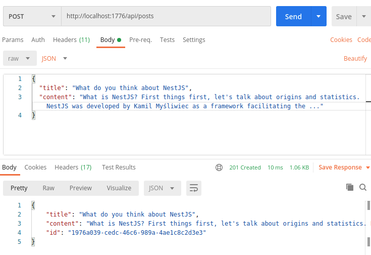
  </div>

  Get all posts:
  <div align="center">
    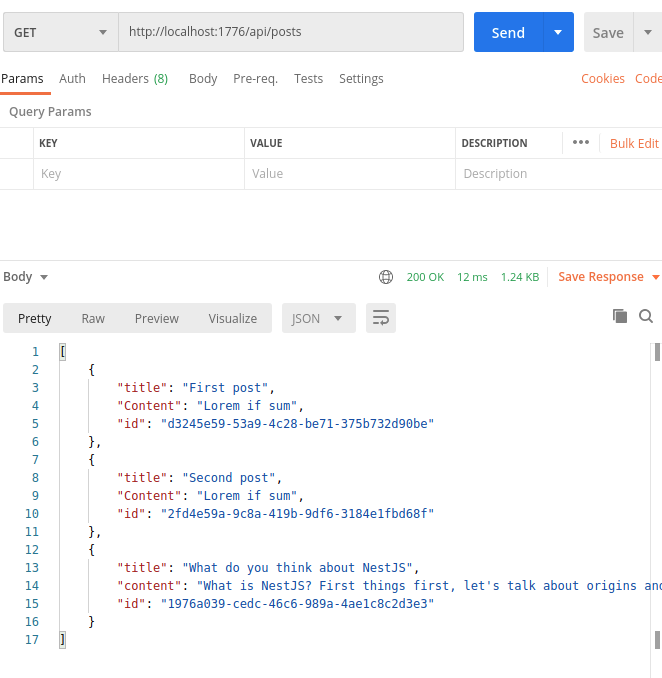
  </div>
  ...

</details>


---
## 2. TypeORM

<details>
<summary>Click here to expand section</summary>

Check the code at branch [2-typeorm](https://gitlab.com/tienduy-nguyen/nestjs-flow/-/tree/2-typeorm)

---

In the first part, we are used an array to fake database. In this part, we will use the real database PostgreQL with TypeORM.

[TypeORM](https://github.com/typeorm/typeorm) is an object relation mapping (open source) for Database SQL (SQlite, PostgreSQL, MySQL, MSSQL and also for mongodb). It make the work more easier with SQL query.

You can consider use [Prisma](https://github.com/prisma/prisma) - the next generation of TypeORM. It is a awesome tool, solve many trouble of TypeORM. But there are some interesting features is under preview version.


- Install dependencies
  ```bash
  $ yarn add @nest/typeorm typeorm pg
  ```
- Config ORM
  Update variables in `.env` file
  ```env
  SERVER_PORT=1776
  ROUTE_GLOBAL_PREFIX=/api
  JWT_SECRET=justanotherworld

  # Typeorm
  TYPEORM_CONNECTION = postgres
  TYPEORM_HOST = postgres
  TYPEORM_USERNAME = postgres
  TYPEORM_PASSWORD = postgres
  TYPEORM_DATABASE = test_db
  TYPEORM_PORT = 5432
  TYPEORM_ENTITIES = [src/modules/**/*.entity.ts]

  # For run migration cli
  TYPEORM_MIGRATIONS=[src/common/migrations/**/*.ts]
  TYPEORM_MIGRATIONS_DIR=src/common/migrations

  ```


  Create `src/common/config/ormConfig.ts`
  ```ts
  // ormConfig.ts
  export function ormConfig(): any {
  return {
      type: process.env.TYPEORM_CONNECTION,
      host: process.env.TYPEORM_HOST,
      port: Number(process.env.TYPEORM_PORT),
      username: process.env.TYPEORM_USERNAME,
      password: process.env.TYPEORM_PASSWORD,
      database: process.env.TYPEORM_DATABASE,
      autoLoadEntities: true,
      entities: [join(__dirname, '**', '*.entity.{ts,js}')],
      logging: false,
      synchronize: true,
    };
  }
  ```
  As we setup ConfigModule with `@Nestjs/Config`, so now we can use directly `process.env` to access directly variable environment;

  **Note**: Check [Nest database](https://docs.nestjs.com/techniques/database) or [Typeorm](https://github.com/typeorm/typeorm) to understand how to config that.

  - **type**: sql driver as: postgres, mysql, mssql, mongodb ...
  - **host**: host of your database (localhost eg.)
  - **username** & **password**: permission user to controler database
  - **database**: name of database that you use for this project
  - **logging**: logging when query database  in the terminal (recommend: false)
  - **synchronize**: true. It means all the  modification in entities will synchronize automatically with your database. Attention for this feature: It will be very dangerous. You can be lost your data, should use only for develop phrase.
  - **entities**: an arry to indicate where stock entity files

  If you don't want `synchronize` automatically, you need consider use cli to make the migrations.

- Import `ormConfig` in `app.module`

  ```ts
  //app.module.ts
  import { PostModule } from '@modules/post/post.module';
  import { Module } from '@nestjs/common';
  import { AppController } from './app.controller';
  import { AppService } from './app.service';
  import { ConfigModule } from '@nestjs/config';
  import { TypeOrmModule } from '@nestjs/typeorm';
  import { ormConfig } from '@common/config/ormConfig';

  @Module({
    imports: [
      ConfigModule.forRoot({
        isGlobal: true,
        envFilePath: '.env',
      }),
      TypeOrmModule.forRoot(ormConfig()),
      PostModule,
    ],
    controllers: [AppController],
    providers: [AppService],
  })
  export class AppModule {}

  ```
### Post modules
- Create Post entity: `src/modules/post/post.entity.ts`
  Before create a post, we need add `moment-timezone` to handle date with timezone for column date.

  ```ts
  // post.entity.ts
  import { BaseEntity, Column, Entity, PrimaryGeneratedColumn } from 'typeorm';
  import moment from 'moment-timezone';
  @Entity()
  export class Post extends BaseEntity {
    @PrimaryGeneratedColumn('uuid')
    id: string;

    @Column()
    title: string;

    @Column()
    content: string;

    @Column({
      type: Date,
      default: moment(new Date()).format('YYYY-MM-DD HH:ss'),
    })
    createdAt;

    @Column({
      type: Date,
      default: moment(new Date()).format('YYYY-MM-DD HH:ss'),
      nullable: true
    })
    updatedAt;
  }
  ```
  In the previous part, we use **uuid** package to create fake uuid. But typeorm already provide a decorator method: `@PrimaryGeneratedColumn(uuid)`. If you only want to create id: number, you just use: `@PrimaryGeneratedColumn(id)`

  Decorator method `@Column` is equivalent a column of table.


  Check [Database](https://docs.nestjs.com/techniques/database) for more details.

- Using PostEntity & PostRepository in PostService


  Now we will modify the old code of first part, and update theme with typeorm solution.

  As we know, Nest use strongly dependency injection pattern, it provide also for inject Repository too --> (`@InjectRepository(Entity)`)

  ```ts
  // post.service.ts
  import { Injectable, NotFoundException } from '@nestjs/common';
  import { CreatePostDto, UpdatePostDto } from './dto';
  import { InjectRepository } from '@nestjs/typeorm';
  import { Repository } from 'typeorm';
  import { Post } from './post.entity';

  @Injectable()
  export class PostService {
    constructor(
      @InjectRepository(Post)
      private readonly postRepository: Repository<Post>,
    ) {}

    public async getPosts(): Promise<Post[]> {
      return this.postRepository.find();
    }

    public async getPostById(id: string): Promise<Post> {
      const post = this.postRepository.findOne({ where: { id: id } });
      if (!post) {
        throw new NotFoundException(`Post with id ${id} not found`);
      }
      return post;
    }

    public async createPost(postDto: CreatePostDto): Promise<Post> {
      const post = this.postRepository.create(postDto);
      await this.postRepository.save(post);
      return post;
    }
    public async updatePost(id: string, postDto: UpdatePostDto): Promise<Post> {
      const post = await this.postRepository.findOne({ where: { id: id } });
      if (!post) {
        throw new NotFoundException(`Post with id ${post.id} not found`);
      }
      const updated = Object.assign(post, postDto);
      updated.updatedAt = Date.now();
      await this.postRepository.save(updated);
      return updated;
    }

    public async deletePost(id: string): Promise<void> {
      await this.postRepository.delete(id);
    }
  }

  ```

  PostController will be not changed.
- Run server & test api endpoints with postman

### Documentation with Swagger/Open API

To better check  available you api endpoint, I think it's usefull to setup Swagger documentation as soon as possible.

Check [swagger.io](https://swagger.io/) & [Nest Open api](https://docs.nestjs.com/openapi/introduction) for more information.

- Installation
  ```bash
  $ yarn add -D @nestjs/swagger swagger-ui-express
  ```
- Setup swagger
  Create swagger constants: `src/common/config/swagger/swagger.contants.ts`
  ```ts
  //swagger.constants.ts
  export const SWAGGER_API_ROOT = 'api/docs';
  export const SWAGGER_API_NAME = 'Simple API';
  export const SWAGGER_API_DESCRIPTION = 'Simple API Description';
  export const SWAGGER_API_CURRENT_VERSION = '1.0';

  ```

  And `src/common/config/swagger/index.ts` for swagger config
  ```ts
  import { INestApplication } from '@nestjs/common';
  import { SwaggerModule, DocumentBuilder } from '@nestjs/swagger';

  import {
    SWAGGER_API_CURRENT_VERSION,
    SWAGGER_API_DESCRIPTION,
    SWAGGER_API_NAME,
    SWAGGER_API_ROOT,
  } from './swagger.constants';

  export const setupSwagger = (app: INestApplication) => {
    const options = new DocumentBuilder()
      .setTitle(SWAGGER_API_NAME)
      .setDescription(SWAGGER_API_DESCRIPTION)
      .setVersion(SWAGGER_API_CURRENT_VERSION)
      .addBearerAuth()
      .build();

    const document = SwaggerModule.createDocument(app, options);
    SwaggerModule.setup(SWAGGER_API_ROOT, app, document);
  };

  ```
- Update swagger config in `main.ts` file
  ```diff
  // main.ts
  async function bootstrap() {
    const app = await NestFactory.create(AppModule);
    app.enableCors();
    app.useGlobalPipes(new ValidationPipe());
    // attaches cookies to request object
    app.use(cookieParser());
    // applies security hardening settings. using defaults: https://www.npmjs.com/package/helmet
    app.use(helmet());
    app.setGlobalPrefix('api');
  + setupSwagger(app);
    const port = process.env.SERVER_PORT;
    await app.listen(port, () => {
      console.log(`Server is running at http://localhost:${port}/`);
    });
  }
  bootstrap();

  ```

- Update swagger tag for controller
  Using `@ApiTags('route name')` class decorator in controller file:
  ```ts
  @ApiTags('Root')
  @Controller()
  export class AppController {
  ...
  }

  @ApiTags('Post')
  @Controller('posts')
  export class PostController {
  ...
  }
  ```
- Run server and check api docs at route: `/api/docs`:
  <div align="center">
    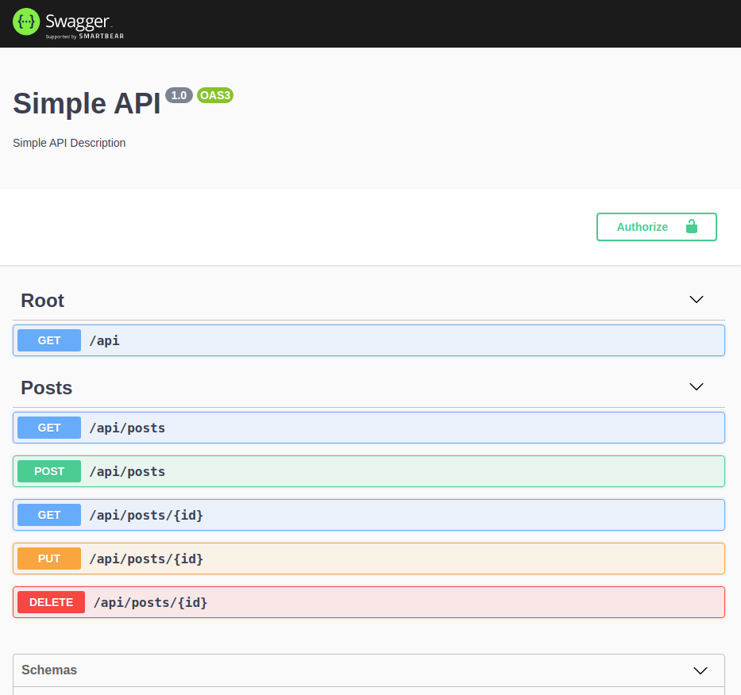
  </div>

</details>

---


## 3. Auth

<details>
<summary>Click to expand section</summary>

Check the code at branch [3-auth](https://gitlab.com/tienduy-nguyen/nestjs-flow/-/tree/3-auth)

Create authentication with bcrypt, passport Nestjs, Jwt & cookies

Check [Nest security](https://docs.nestjs.com/security/authentication) for more information.

### User

To use authentication, first of all, wee need to have User table.

- Create UserEntity with Typeorm: `src/modules/user/user.entity.ts`
  ```ts
  //user.entity.ts
  import { Entity, Column, PrimaryGeneratedColumn } from 'typeorm';

  @Entity()
  export class User {
    @PrimaryGeneratedColumn('uuid')
    id: string;

    @Column()
    name: string;

    @Column({ unique: true })
    email: string;

    @Column()
    password: string;
  }

  ```
- User service: `src/modules/user/user.service.ts`
  With the demo purpose, we don't need to create UserController (to have route update, delete ... for user). In UserService, we just create some simple helper methods to use in AuthService.

  ```ts
  import { RegisterUserDto } from '@modules/auth/dto';
  import { Injectable } from '@nestjs/common';
  import { InjectRepository } from '@nestjs/typeorm';
  import { Repository } from 'typeorm';
  import { User } from './user.entity';

  @Injectable()
  export class UserService {
    constructor(
      @InjectRepository(User)
      private readonly userRepository: Repository<User>,
    ) {}

    public async getUsers(): Promise<User[]> {
      return await this.userRepository.find();
    }
    public async getUserById(id: string): Promise<User> {
      return await this.userRepository.findOne({ where: { id: id } });
    }
    public async getUserByEmail(email: string): Promise<User> {
      return await this.userRepository.findOne({ where: { email: email } });
    }
    public async create(userDto: RegisterUserDto): Promise<User> {
      const user = this.userRepository.create(userDto);
      await this.userRepository.save(user);
      return user;
    }
  }

  ```
- And update UserModule: `src/modules/user/user.module.ts`
  ```ts
  import { Module } from '@nestjs/common';
  import { TypeOrmModule } from '@nestjs/typeorm';
  import { User } from './user.entity';
  import { UserService } from './user.service';

  @Module({
    imports: [TypeOrmModule.forFeature([User])],
    providers: [UserService],
    exports: [UserService],
  })
  export class UserModule {}

  ```
  **Note**: `TypeOrmModule.forFeature([User])` allows to use UserRepository of TypeOrm in all User providers files.

  Don't forget import `UserModule` in `AppModule`

### Auth

The easiest way protect auth with Nest app is using passport & Json web token strategy.
The docs of Nest well explain this part in details. Check [Nest Authentication](https://docs.nestjs.com/security/authentication#authentication)

There are two strategies:
- Passport strategy: We will use passport-local to authenticate when user login
- Json web token strategy: using in all other protected routes

When an user login, it will verify email (or username) & password. If it match, an user logged is assigned in Request. And we will save information of this user in cookie by the json token code. This json web token will be verified in each request in each route that we implements Jwt guards.

Ok, that's is a little bit theory. Now, we will start to code to better understand it.

#### Installation

For this part, we need to install packages:
- [bcrypt](https://github.com/kelektiv/node.bcrypt.js/): For hashing password
- [passport-jwt](https://github.com/mikenicholson/passport-jwt): passport strategy with json web token
- **@nestjs/jwt** & **passport-jwt** to use feature JWT of Nestjs
- [cookie-parser](https://github.com/expressjs/cookie-parser): to parse cookie

  ```bash
  $ yarn add @nestjs/jwt @nestjs/passport passport-jwt cookie-parser bcrypt
  $ yarn add -D @types/bcrypt @types/cookie-parser @types/passport-jwt
  ```
#### Auth service

- Update middleware : ` app.use(cookieParser());` in `main.ts` file.

- Create `auth.service.ts` file in `src/modules/auth`
  ```ts
  // auth.service.ts
  import {
    BadRequestException,
    ConflictException,
    HttpException,
    HttpStatus,
    Injectable,
  } from '@nestjs/common';
  import * as bcrypt from 'bcrypt';
  import { JwtService } from '@nestjs/jwt';
  import { IPayloadJwt } from './auth.interface';
  import { RegisterUserDto } from './dto';
  import { UserService } from '@modules/user/user.service';

  @Injectable()
  export class AuthService {
    constructor(
      private readonly userService: UserService,
      private readonly jwtService: JwtService,
    ) {}

    public async validateUser(email: string, password: string) {
      const user = await this.userService.getUserByEmail(email);
      if (user) {
        const isMatch = await bcrypt.compare(password, user.password);
        if (isMatch) {
          return user;
        }
      }
      throw new BadRequestException('Invalids credentials');
    }

    public async register(registerDto: RegisterUserDto) {
      const userCheck = await this.userService.getUserByEmail(registerDto.email);
      if (userCheck) {
        throw new ConflictException(
          `User with email: ${registerDto.email} already exists`,
        );
      }
      const salt = await bcrypt.genSalt(10);
      const hashPassword = await bcrypt.hash(registerDto.password, salt);

      try {
        const user = await this.userService.create({
          ...registerDto,
          password: hashPassword,
        });
        return user;
      } catch (error) {
        throw new HttpException(error.message, HttpStatus.INTERNAL_SERVER_ERROR);
      }
    }

    public getCookieWithToken(payload: IPayloadJwt) {
      const token = this.jwtService.sign(payload);
      return `Authorization=${token};HttpOnly;Path=/;Max-Age=${process.env.JWT_EXPIRATION_TIME}`;
    }
    public clearCookie() {
      return `Authorization=;HttpOnly;Path=/;Max-Age=0`;
    }
  }

  ```

  - In AuthService, we inject UserService and JwtService (provide by `@nestjs/jwt`)
  - **register** method: using when an user want to register new account
  - **validateUser** method: Use to verify email & password given by user request. We will use this method in local-password strategy too.
  - **getCookie** methods: using to generate cookies with jwt & clear it when user logged out.
- Create auth strategies
  - Create Passport local strategy
    Create `local.strategy.ts` in `src/modules/auth/strategies`:
    ```ts
    // local.strategy.ts
    import { User } from '@modules/user/user.entity';
    import { Injectable } from '@nestjs/common';
    import { PassportStrategy } from '@nestjs/passport';
    import { Strategy } from 'passport-local';
    import { AuthService } from '../auth.service';

    @Injectable()
    export class LocalStrategy extends PassportStrategy(Strategy) {
      constructor(private _authService: AuthService) {
        super({ usernameField: 'email' });
      }

      public async validate(email: string, password: string): Promise<User> {
        const user = await this._authService.validateUser(email, password);
        return user;
      }
    }

    ```
    This stragety is very simple. We create class `LocalStrategy` extends from `PassportStrategy` of @Nestjs/passport module.

    We use `super({ usernameField: 'email' });`: that means we use the field 'email' to verify account. By default with `super()` is 'username'.

    In this class, we need have an method `validate`. The passport strategy of Nestjs will trigger this method automatically for Passport guard.

    **Note**: don't for get use `@Injectable()` to make this class as a custom providers to import or export in Auth module.

  - Create Jwt strategy: `jwt.strategy.ts`
    ```ts
    // jwt.strategy.ts
    import { IPayloadJwt } from '../auth.interface';
    import { Injectable } from '@nestjs/common';
    import { ExtractJwt, Strategy } from 'passport-jwt';
    import { PassportStrategy } from '@nestjs/passport';
    import { UserService } from '@modules/user/user.service';
    import { Request } from 'express';

    @Injectable()
    export class JwtStrategy extends PassportStrategy(Strategy) {
      constructor(private readonly userService: UserService) {
        super({
          jwtFromRequest: ExtractJwt.fromExtractors([
            (req: Request) => {
              return req?.cookies?.Authorization;
            },
          ]),
          ignoreExpiration: false,
          secretOrKey: process.env.JWT_SECRET,
        });
      }
      public async validate(payload: IPayloadJwt) {
        const user = await this.userService.getUserByEmail(payload.email);
        return user;
      }
    }


    ```

    - Principe of Jwt strategy is the same with local passport strategy. But in the implement `super()` of parent class, we need setup some config for jwt & cookies.
    - `JWT_SECRET`: variable environment setup in **.env** file
    - If you don't want to you extract cookie, just extract with Bearer authentication header:

      ```ts
      super({
        jwtFromRequest: ExtractJwt.fromAuthHeaderAsBearerToken(),
        ignoreExpiration: false,
        secretOrKey: process.env.JWT_SECRET,
      });
      ```
  - Create `guards` files to indicate which guard auth we will use for routing
    - `local-auth.guard.ts`

      ```ts
      // local.strategy.ts
      import { Injectable } from '@nestjs/common';
      import { AuthGuard } from '@nestjs/passport';

      @Injectable()
      export class LocalAuthGuard extends AuthGuard('local') {}
      ```

    - `jwt-auth.guard.ts`

      ```ts
      // jwt.guard.ts
      import { Injectable } from '@nestjs/common';
      import { AuthGuard } from '@nestjs/passport';

      @Injectable()
      export class JwtAuthGuard extends AuthGuard('jwt') {}

      ```

#### Auth controller

Ok, now we will update **auth guard in our routes**
  - Create AuthController: `src/modules/auth/auth.controller.ts`

    ```ts
    // auth.controller
    import { IRequestWithUser } from '@common/interfaces/http.interface';
    import {
      Body,
      Controller,
      Get,
      Post,
      Req,
      Res,
      UseGuards,
    } from '@nestjs/common';
    import { IPayloadJwt } from './auth.interface';
    import { AuthService } from './auth.service';
    import { RegisterUserDto } from './dto';
    import { LocalAuthGuard } from './guards/local-auth.guard';
    import { Response } from 'express';
    import { JwtAuthGuard } from './guards/jwt-auth.guard';
    import { ApiTags } from '@nestjs/swagger';

    @ApiTags('Auth')
    @Controller('auth')
    export class AuthController {
      constructor(private readonly authService: AuthService) {}

      @Post()
      public async register(@Body() registerDto: RegisterUserDto) {
        const user = await this.authService.register(registerDto);
        // eslint-disable-next-line @typescript-eslint/no-unused-vars
        const { password, ...rest } = user;
        return rest;
      }

      @Post('login')
      @UseGuards(LocalAuthGuard)
      public async login(@Req() req: IRequestWithUser, @Res() res: Response) {
        const { user } = req;
        const payload: IPayloadJwt = {
          userId: user.id,
          email: user.email,
        };
        const cookie = this.authService.getCookieWithToken(payload);
        res.setHeader('Set-Cookie', cookie);
        // eslint-disable-next-line @typescript-eslint/no-unused-vars
        const { password, ...rest } = user;
        return res.send(rest);
      }

      @Get()
      @UseGuards(JwtAuthGuard)
      public getAuthenticatedUser(@Req() req: IRequestWithUser) {
        // eslint-disable-next-line @typescript-eslint/no-unused-vars
        const { password, ...rest } = req.user;
        return rest;
      }

      @Post('logout')
      @UseGuards(JwtAuthGuard)
      public async logout(@Res() res: Response) {
        res.setHeader('Set-Cookie', this.authService.clearCookie());
        return res.sendStatus(200);
      }
    }

    ```
    - `@UseGuards(LocalAuthGuard)`: for local strategy --> using for login
    - `@UseGuards(JwtAuthGuard)`: for jwt strategy --> using to protect our routes

      When use login, we need to set cookie with new json web token.

- Update also auth Guards in `Postcontroller`

#### Complete authentication part

- Create `auth.module.ts`
  ```ts
  import { Module } from '@nestjs/common';
  import { AuthService } from './auth.service';
  import { LocalStrategy } from './strategies/local.strategy';
  import { PassportModule } from '@nestjs/passport';
  import { UserModule } from '@modules/user/user.module';
  import { JwtModule } from '@nestjs/jwt';
  import { JwtStrategy } from './strategies/jwt.strategy';
  import { AuthController } from './auth.controller';
  @Module({
    imports: [
      UserModule,
      PassportModule,
      JwtModule.register({
        secret: process.env.JWT_SECRET,
        signOptions: { expiresIn: process.env.JWT_EXPIRE_TIME },
      }),
    ],
    providers: [AuthService, LocalStrategy, JwtStrategy],
    exports: [AuthService],
    controllers: [AuthController],
  })
  export class AuthModule {}

  ```
- Import `AuthModule` in `AppModule` and run server to test

  **Note**: To test cookie with postman: If the project works properly, when you logged successfully, a cookie will be created automatically.

  But if you want to use this cookie to test other protected routes, you need to copie that and add it to header with the key: "Cookie" --> value: value of cookie copied

  See the photo to better understand.

  <div align="center">
  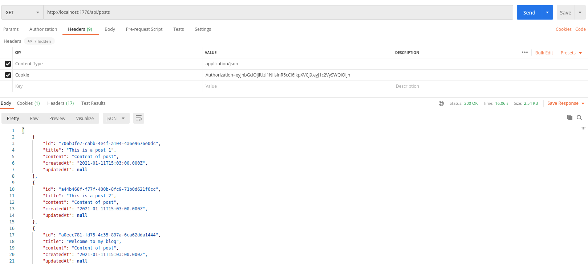
  </div>
</details>

---

## 4. Error handling

<details>
<summary>Click to expand section</summary>

Check the code at branch [4-error-handling](https://gitlab.com/tienduy-nguyen/nestjs-flow/-/tree/4-error-handling)

### Exception filter

Nest use built-in exception layer which is responsible for processing all unhandled exceptions across an application.

Check [Nest exception filter](https://docs.nestjs.com/exception-filters) for information details.

- Format of an exception:

  ```ts
  {
    "statusCode": number,
    "message": string
  }

  ```
- Throw standard exception in Nest
  Here is some examples using Exception filter in app:
  ```ts
  const post = await this.postRepository.findOne({ where: { id: id } });
    if (!post) {
      throw new NotFoundException(`Post with id ${post.id} not found`);
    }
  ```

  ```ts
  const user = await this.userService.getUserByEmail(email);
    if (user) {
      const isMatch = await bcrypt.compare(password, user.password);
      if (isMatch) {
        return user;
      }
    }
    throw new BadRequestException('Invalids credentials');

  ```

  ```ts
  const userCheck = await this.userService.getUserByEmail(registerDto.email);
    if (userCheck) {
      throw new ConflictException(
        `User with email: ${registerDto.email} already exists`,
      );
    }
  ```

  ```ts
  } catch (error) {
      throw new HttpException(error.message, HttpStatus.INTERNAL_SERVER_ERROR);
    }
  ```
- Create custom exception: Logger exception

  ex: Forbidden.exception.ts
  ```ts
  export class ForbiddenException extends HttpException {
    constructor() {
      super('Forbidden', HttpStatus.FORBIDDEN);
    }
  }

  ```
  Check more [Nest exception filter](https://docs.nestjs.com/exception-filters).

### Validation

Nest provides several pipes available right out-of-the-box:

- ValidationPipe
- ParseIntPipe
- ParseBoolPipe
- ParseArrayPipe
- ParseUUIDPipe

The ValidationPipe makes use of the powerful [class-validator](https://github.com/typestack/class-validator) package and its declarative validation decorators.

The ValidationPipe provides a convenient approach to enforce validation rules for all incoming client payloads, where the specific rules are declared with simple annotations in local class/DTO declarations in each module.

We will use auto-validation of Nest:
- Setup in `main.ts`
  ```ts
  // main.ts
  async function bootstrap() {
    const app = await NestFactory.create(AppModule);
    app.useGlobalPipes(new ValidationPipe());
    ...
  }
  bootstrap();
  ```
- Install indispensable package dependency to make it works:
  - [Class-validator](https://github.com/typestack/class-validator)
  - [Class-transformer](https://github.com/typestack/class-transformer)

  ```bash
  $ yarn add class-transformer class-validator
  ```
- Using class-validator
  We will use this package to make sûre that we have good data for body request (DTO) & for entity data before save to database.

  Example using validation in `user.entity.ts`

  ```ts
  // user.entity.ts
  import { Entity, Column, PrimaryGeneratedColumn } from 'typeorm';
  import { IsDate, IsEmail, Min } from 'class-validator';
  import moment from 'moment';

  @Entity()
  export class User {
    @PrimaryGeneratedColumn('uuid')
    id: string;

    @Column()
    name: string;

    @Column({ unique: true })
    @IsEmail()
    email: string;

    @Column()
    @Min(0)
    password: string;

    @Column({
      type: Date,
      default: moment(new Date()).format('YYYY-MM-DD HH:ss'),
      nullable: true,
    })
    @IsDate()
    createdAt: Date;

    @Column({
      type: Date,
      default: moment(new Date()).format('YYYY-MM-DD HH:ss'),
      nullable: true,
    })
    @IsDate()
    updatedAt: Date;
  }

  ```
  Example in `create-post.dto.ts`

  ```ts
  import { IsString } from 'class-validator';

  export class CreatePostDto {
    @IsString()
    title: string;

    @IsString()
    content: string;
  }

  ```

Check more [Doc class-validator](https://github.com/typestack/class-validator/blob/develop/docs/basics/validating-objects.md) for advanced validation.

</details>

---

## 5. Serialization

<details>
<summary>Click to expand section</summary>

Check the code at branch [5-serialization](https://gitlab.com/tienduy-nguyen/nestjs-flow/-/tree/5-serialization)

If you remember, in previous part, when we want to return **user** from request, we need to exclude `password` field with destructuring Javascript method.

But in the real project, we will have many secret field, we will don't do like that. Normally, we can  create data transfer object and create the mapper method from real object to dto object. Then it will return a safe data for client.

The Nest framework make use of powerful of **class-transformer**, it helps us to resolve this problem more simpler. Check out [Nest serialization](https://docs.nestjs.com/techniques/serialization)

Now, we see how to implement Nest serialization:
### Exclude option
- Using `Exclude` in entities

  User Entity:
  ```diff
  // user.entity.ts
  import { Entity, Column, PrimaryGeneratedColumn } from 'typeorm';
  import { IsDate, IsEmail, Min } from 'class-validator';
  import moment from 'moment';
  + import { Exclude } from 'class-transformer';

  @Entity()
  export class User {
    @Column()
    @Min(0)
  +   @Exclude()
    password: string;
  ```
- Using `ClassSerializerInterceptor` in **controller**
  ```ts
  // auth.controller.ts
  @Controller('auth')
  @UseInterceptors(ClassSerializerInterceptor)
  export class AuthController {
  ...
  }
  ```

  Or we can set global for `ClassSerializerInterceptor`

  ```diff
  // main.ts
  async function bootstrap() {
  const app = await NestFactory.create(AppModule);
  app.enableCors();
  app.useGlobalPipes(new ValidationPipe({ skipMissingProperties: true }));
  + app.useGlobalInterceptors(new ClassSerializerInterceptor(app.get(Reflector)));
  ...
  }

  ```
### Expose option

- `@SerializeOptions()`
  By default, all properties of our entities are exposed. We can change this strategy by providing additional options to the **class-transformer**.
  ```ts
  @Controller('auth')
  @SerializeOptions({
    strategy: 'excludeAll'
  })
  export class AuthenticationController
  ```
  And  `user.entity.ts`
  ```ts
  import { Column, Entity, PrimaryGeneratedColumn } from 'typeorm';
  import { Expose } from 'class-transformer';

  @Entity()
  class User {
    @PrimaryGeneratedColumn('uuid')
    public id?: string;

    @Column({ unique: true })
    @Expose()
    public email: string;

    @Column()
    @Expose()
    public name: string;

    @Column()
    public password: string;
  }

  export default User;
  ```

  Example results:
  First result before use option `expose`:
  ```json
  {
    "name": "user1",
    "email": "user1@gmail.com",
    "passport": "£ùdsql!-$fhkqpsdfhosdhfsdhf$+o~qsd*46dfqsdf"
  }
  ```
  ---> Result after expose All:
  ```json
  {
    "name": "user1",
    "email": "user1@gmail.com",
  }
  ```

- Nullable features of **class-transformer**
  The `@SerializeOptions()` matchs the options that you can provide for the `classToPlain` method in the **class-transformer**.

  For example: before you use `@Column({nullable: true})`, but with NestJs & Class-transformer, you can make like you code typescript directly:

  ```ts
  @Entity()
  class Post {
    // ...

    @Column({ nullable: true })
    public category?: string;
  }
  ```
  Or if you don't want to return to response when this field null with `@Transform` of `class-transformer`.
  ```ts
  @Column({ nullable: true })
   @Transform((value) => {
    if (value) {
      return value;
    }
  })
  public category?: string;
  ```

### Issues with using @Res() decorator

In the previous part, we have used the `@Res()` decorator to access the Express Response object.
- Previous method login in `AuthController`
  ```ts
  // auth.controller.ts
  @Post('login')
    @UseGuards(LocalAuthGuard)
    public async login(@Req() req: IRequestWithUser, @Res() res: Response) {
      const { user } = req;
      const payload: IPayloadJwt = {
        userId: user.id,
        email: user.email,
      };
      const cookie = this.authService.getCookieWithToken(payload);
      res.setHeader('Set-Cookie', cookie);
      // eslint-disable-next-line @typescript-eslint/no-unused-vars
      const { password, ...rest } = user;
      return res.send(rest);
    }

  ```
  Using the  `@Res()` decorator strips us from some advantages of using NestJS. Unfortunately, it interferes with the  `ClassSerializerInterceptor`. To prevent that, we can follow [some advice from the creator of NestJS](https://github.com/nestjs/nest/issues/284#issuecomment-348639598). If we use the  request.res object instead of the  `@Res()` decorator, we don’t put NestJS into the express-specific mode.

  Solution:
  ```ts
  // auth.controller.ts
  @Post('login')
  @UseGuards(LocalAuthGuard)
  public async login(@Req() req: IRequestWithUser) {
    const { user } = req;
    const payload: IPayloadJwt = {
      userId: user.id,
      email: user.email,
    };
    const cookie = this.authService.getCookieWithToken(payload);
    req.res.setHeader('Set-Cookie', cookie);
    return user;
  }
  ```

</details>


---

## 6. Database relationship

<details>
<summary>Click to expand section</summary>

Check the code at branch [6-db-relationship](https://gitlab.com/tienduy-nguyen/nestjs-flow/-/tree/6-db-relationship)

About database relationship of Typeorm, check:
- [Typeorm one to one relations](https://github.com/typeorm/typeorm/blob/master/docs/one-to-one-relations.md)
- [Typeorm relations](https://github.com/typeorm/typeorm/blob/master/docs/relations.md)
- [Typeorm relations faq](https://github.com/typeorm/typeorm/blob/master/docs/relations-faq.md)
- [Typeorm relational query builder](https://github.com/typeorm/typeorm/blob/master/docs/relational-query-builder.md)

**Missing docs for this part. Working in progress....**

</details>

---


## 7. Testing

<details>
<summary>Click to expand section</summary>

Check the code at branch [7-testing](https://gitlab.com/tienduy-nguyen/nestjs-flow/-/tree/7-testing)

- Unit testing
- Integration testing

Run test: `yarn test`:

<div align="center">
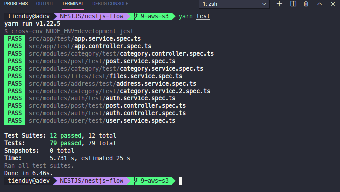
</div>

**Missing docs for this part. Working in progress....**

</details>

---


## 8. End to end testing (e2e)

<details>
<summary>Click to expand section</summary>

Check the code at branch [8-e2e-testing](https://gitlab.com/tienduy-nguyen/nestjs-flow/-/tree/8-e2e-testing)

Check more information at [Nestjs end to end testing](https://docs.nestjs.com/fundamentals/testing)

### Introduction

Unlike unit testings (individual modules, methods or class test), **end to end** testing  focus on the integrity of the application. We will test the entire application from start to finish, just like a regular user would, to see if it behaves as expected.

Nest makes it easy to use the [Supertest](https://github.com/visionmedia/supertest) library to simulate HTTP requests.

When we create project with **Nest CLI**, if you remember, there is always an folder **test** was create in the root project. In this folder, we we save our file **end-to-end(e2e)** testing.

### Test root folder
In the **test** root folder (`<rootDir>/test`), we have 2 files:
- **jest-e2e.json**: Config for e2e test
  `jest-e2e.json` generated from **Nest ClI**:
  ```json
  {
    "moduleFileExtensions": ["js", "json", "ts"],
    "rootDir": ".",
    "testEnvironment": "node",
    "testRegex": ".e2e-spec.ts$",
    "transform": {
      "^.+\\.(t|j)s$": "ts-jest"
    }
  }

  ```
- **app.e2e-spec.ts**: File test for app module. We can create each files e2e test for each controller. But in our demo, we don't have many controller, to simplify, we can  put all the test code of all controllers in this **app.e2e-spec.ts** file.
  ```ts
  // test/app.e2e-spec.ts
  import { Test, TestingModule } from '@nestjs/testing';
  import { INestApplication } from '@nestjs/common';
  import * as request from 'supertest';
  import { AppModule } from '../src/app.module';

  describe('AppController (e2e)', () => {
    let app: INestApplication;

    beforeEach(async () => {
      const moduleFixture: TestingModule = await Test.createTestingModule({
        imports: [AppModule],
      }).compile();

      app = moduleFixture.createNestApplication();
      await app.init();
    });

    it('/ (GET)', () => {
      return request(app.getHttpServer())
        .get('/')
        .expect(200)
        .expect('Hello World!');
    });
  });

  ```


- For running e2e test, Nest has already setup it in `package.json` file: `yarn test:e2e`


**Note**: For name of e2e test file, make sure you have suffix `.e2e-spec.ts`, because, if you look in `jest-e2e.json`, it matches only with this suffix (Or you can change as you want, but you need match them together)

### Develop
- Firstly, we will modify a little bit config in `jest-e2e.json` to work properly with our project:

  `jest-e2e.json` file:
  ```json
  {
    "moduleFileExtensions": ["js", "json", "ts"],
    "rootDir": "../",
    "testEnvironment": "node",
    "testRegex": ".e2e-spec.ts$",
    "transform": {
      "^.+\\.(t|j)s$": "ts-jest"
    },
    "moduleNameMapper": {
      "@common/(.*)": "<rootDir>/src/common/$1",
      "@modules/(.*)": "<rootDir>/src/modules/$1",
      "@app/(.*)": "<rootDir>/src/app/$1"
    }
  }

  ```
Now we will start make e2e test for each module.
- **AppModule**
  As **AppModule** has only an root route, and it return 'Hello world' when an user request. So the e2e test we will be like this:
  ```ts
  import { Test, TestingModule } from '@nestjs/testing';
  import { INestApplication } from '@nestjs/common';
  import request from 'supertest';
  import { AppModule } from '../src/app/app.module';

  describe('AppController (e2e)', () => {
    let app: INestApplication;

    beforeAll(async () => {
      const moduleFixture: TestingModule = await Test.createTestingModule({
        imports: [AppModule],
      }).compile();

      app = moduleFixture.createNestApplication();
      // app.useGlobalPipes(new ValidationPipe({ skipMissingProperties: true }));
      // app.useGlobalInterceptors(new ClassSerializerInterceptor(app.get(Reflector)));
      await app.init();
    });

    afterAll(async () => {
      await app.close();
    });

    /* Root */
    describe('AppModule', () => {
      it('(GET) /', () => {
        return request(app.getHttpServer())
          .get('/')
          .expect(200)
          .expect('Hello World!');
      });
    });

  });
  ```
  - When user request to root (/), we will need request successfully, it will return with status code = 200 and body = 'Hello World!')

  **Note**: Here is just simple setup for app initialization, but you can setup all necessary configurations for your app  as in `main.ts` file for app too.

  For example: `app.useGlobalPipes(...)`, `app.useGlobalInterceptors(...)`, `app.enableCors()`...et...

### Other modules

The end to end testing focus on user story, so it's better you make the test follow this approach. For example: When you go to website:
- You will request root route first
- After you create an account
- You check login route
- After login (setHeader with cookie), now we have been authenticated
- Check the public routes as `get posts`, `get categories`
- Test actions in private route as `createPost`, `updatePost`; `deletePost`...
- We can create also another file test for another approach with non authenticate and check authorization access route

Example for test e2e login:
```ts
  /* Auth */
  describe('AuthModule', () => {
    describe('(POST) /auth/login', () => {
      it('Should login successfully', async () => {
        const user = {
          email: 'user1@gmail.com',
          password: '1234567',
        };
        const data = await request(app.getHttpServer())
          .post('/auth/login')
          .send(user)
          .expect(201);
        expect(data.body).toBeDefined();
      });
    });
  });
```

In this part, there will have much code to do. I will come back to update them.

--> **Work in progress ...**

</details>

---

## 9.1  Web service AWS S3


<details>
<summary>Click to expand section</summary>

Check the code at branch [9-aws-s3](https://gitlab.com/tienduy-nguyen/nestjs-flow/-/tree/9-aws-s3)


**Amazon S3** has a simple web services interface that you can use to store and retrieve any amount of data, at any time, from anywhere on the web. It gives any developer access to the same highly scalable, reliable, fast, inexpensive data storage infrastructure that Amazon uses to run its own global network of web sites. The service aims to maximize benefits of scale and to pass those benefits on to developers.
### Create IAM user
To use AWS service S3, make sure you have an [account AWS](https://aws.amazon.com/account/).

Each service of AWS need an [Identity and Access Management (IAM)](https://console.aws.amazon.com/iam/home#/users)

After create an user IAM for S3 service, you will receive an **Access key ID** and an **Secret access key**. We will add them in `.env` file to connect to AWS service through our API.

We also need to choose one of [the available regions](https://docs.aws.amazon.com/AmazonRDS/latest/UserGuide/Concepts.RegionsAndAvailabilityZones.html). For example, my  regions is: **eu-west-3** for Europe France

<div align="center">
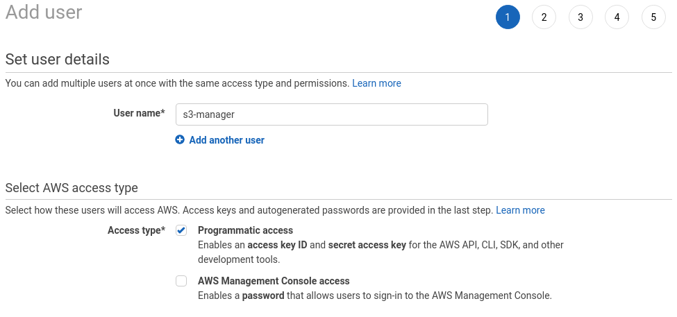
<span> </span>
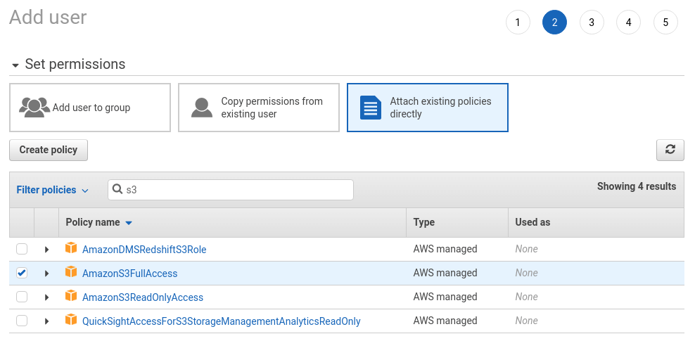

</div>

### Create AWS S3 bucket

In Amazon S3 data is organized in buckets. We can have multiple buckets with different settings.

Let’s open the [Amazon S3 panel](https://console.aws.amazon.com/s3/home?region=us-east-1) and create a bucket. Please note that the name of the bucket must be unique.

<div align=center>
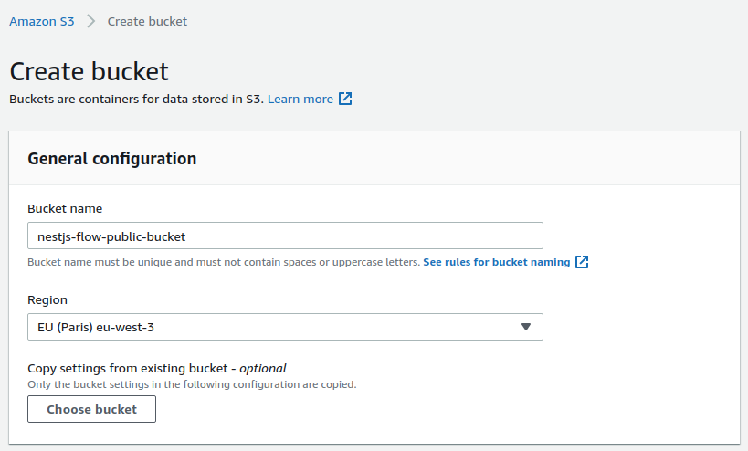
</div>

We can set up our bucket to contain public files. All files that we upload to this bucket will be publicly available. We might use it to manage files such as avatars.
<div align=center>
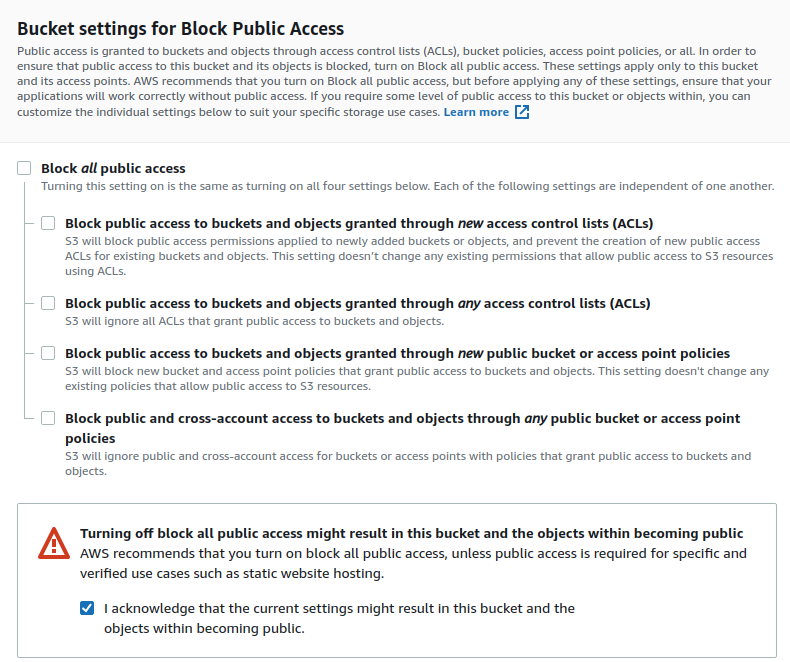
</div>

### Update variables enviroments
Now start to setup connection for AWS in our API
- `.env` file
  ```env
  # ...
  AWS_REGION=eu-west-3
  AWS_ACCESS_KEY_ID=*******
  AWS_SECRET_ACCESS_KEY=*******
  AWS_PUBLIC_BUCKET_NAME=nestjs-flow-public-bucket
  ```

- Update types in `src/common/types/node.d.ts`
  ```ts
  // node.d.ts
    declare namespace NodeJS {
    interface ProcessEnv {
      readonly NODE_ENV: 'development' | 'production' | 'test';
      readonly SERVER_PORT: string;
      readonly TYPEORM_CONNECTION: string;
      readonly TYPEORM_HOST: string;
      readonly TYPEORM_USERNAME: string;
      readonly TYPEORM_PASSWORD: string;
      readonly TYPEORM_DATABASE: string;
      readonly TYPEORM_PORT: string;
      readonly TYPEORM_LOGGING: string;
      readonly TYPEORM_ENTITIES: string;
      readonly TYPEORM_MIGRATIONS: string;
      readonly ROUTE_GLOBAL_PREFIX: string;
      readonly JWT_SECRET: string;
      readonly TWO_FACTOR_AUTHENTICATION_APP_NAME: string;
      readonly JWT_EXPIRATION_TIME: string;
      readonly AWS_REGION: string;
      readonly AWS_ACCESS_KEY_ID: string;
      readonly AWS_SECRET_ACCESS_KEY: string;
      readonly AWS_PUBLIC_BUCKET_NAME: string;
    }
  }

  ```

- To connect with AWS service, we need to install [aws-sdk-js](https://github.com/aws/aws-sdk-js)
  ```bash
  $ yarn add aws-sdk
  $ yarn add -D @types/aws-sdk
  ```
### Create FileModule
We will use AWS S3 to upload avatar of user.

- Create `src/modules/files/public-file.entity.ts`

  ```ts
  // public-file.entity.ts
  import { Column, Entity, OneToOne, PrimaryGeneratedColumn } from 'typeorm';

  @Entity()
  export class PublicFile {
    @PrimaryGeneratedColumn('uuid')
    public id: string;

    @Column({ unique: true })
    public key: string;

    @Column()
    public url: string;
  }
  ```
- Create `src/modules/files/services/s3.service.ts`
  ```ts
  // s3.service.ts
  import { Injectable } from '@nestjs/common';
  import { S3 } from 'aws-sdk';
  import { v4 as uuid } from 'uuid';
  import { DeletePublicFileDto } from '../dto';

  @Injectable()
  export class S3Service {
    private s3: S3;
    private bucketName: string;
    constructor() {
      this.s3 = new S3();
      this.bucketName = process.env.AWS_PUBLIC_BUCKET_NAME;
    }
    public async uploadResult(
      dataBuffer: Buffer,
      filename: string,
    ): Promise<S3.ManagedUpload.SendData> {
      const uploadResult = await this.s3
        .upload({
          Bucket: this.bucketName,
          Body: dataBuffer,
          Key: `${uuid()}-${filename}`,
        })
        .promise();
      return uploadResult;
    }

    public async deleteFile(fileDto: DeletePublicFileDto) {
      await this.s3
        .deleteObject({
          Bucket: process.env.AWS_PUBLIC_BUCKET_NAME,
          Key: fileDto.key,
        })
        .promise();
      return { deleted: true };
    }
  }

  ```
  Why we need an file dependent for s3Service? --> We use the dependents service for easier in test.
- Create `src/modules/files/services/files.service.ts`
  ```ts
  // files.service.ts
  import {
    HttpException,
    HttpStatus,
    Injectable,
    NotFoundException,
  } from '@nestjs/common';
  import { InjectRepository } from '@nestjs/typeorm';
  import { PublicFileRepository } from '../public-file.repository';

  import { CreatePublicFileDto, DeletePublicFileDto } from '../dto';
  import { S3Service } from './s3.service';
  import { PublicFile } from '../public-file.entity';

  @Injectable()
  export class FilesService {
    constructor(
      @InjectRepository(PublicFileRepository)
      private readonly publicFileRepo: PublicFileRepository,
      private readonly s3Service: S3Service,
    ) {}

    public async getFileById(id: string) {
      try {
        const file = this.publicFileRepo.getFileById(id);
        if (!file) {
          throw new NotFoundException('File not found');
        }
        return file;
      } catch (error) {
        if (error.status === HttpStatus.NOT_FOUND) {
          throw error;
        }
        throw new HttpException(error.message, HttpStatus.NOT_FOUND);
      }
    }

    public async uploadPublicFile(dataBuffer: Buffer, filename: string) {
      try {
        const uploadResult = await this.s3Service.uploadResult(
          dataBuffer,
          filename,
        );
        const fileDto: CreatePublicFileDto = {
          key: uploadResult.Key,
          url: uploadResult.Location,
        };
        const newFile = await this.publicFileRepo.createPublicFile(fileDto);
        return newFile;
      } catch (error) {
        throw new HttpException(error.message, HttpStatus.INTERNAL_SERVER_ERROR);
      }
    }

    public async deletePublicFile(fileId: string) {
      try {
        const file = await this.publicFileRepo.getFileById(fileId);
        if (!file) {
          throw new NotFoundException('File not found');
        }
        const fileDto: DeletePublicFileDto = {
          key: file.key,
        };
        await this.s3Service.deleteFile(fileDto);

        return await this.publicFileRepo.deleteFile(fileId);
      } catch (error) {
        if (error.status === HttpStatus.NOT_FOUND) {
          throw error;
        } else {
          throw new HttpException(
            error.message,
            HttpStatus.INTERNAL_SERVER_ERROR,
          );
        }
      }
    }
  }

  ```
And we package all these file to **FileModule**

- Using **PublicFile Entity** and **FileService** in UserModule to create **user avatar**.

  User Entity:
  ```ts
  // user.entity.ts
  // ....
  @JoinColumn()
  @OneToOne(() => PublicFile, {
    eager: true,
    nullable: true,
    onDelete: 'CASCADE',
  })
  public avatar: PublicFile;

  @BeforeUpdate()
  updateTimestamp() {
    this.updatedAt = new Date();
  }
  // ...
  ```

- Create methods upload and delete avatar

  In `user.service.ts`: create method: **addAvatar** & **deleteAvatar**

  ```ts
  // user.service.ts

   public async addAvatar(
      userId: string,
      imageBuffer: Buffer,
      filename: string,
    ) {
      try {
        const user = await this.userRepository.getUserById(userId);
        if (user.avatar) {
          await this.userRepository.updateAvatar(user, {
            avatar: null,
          });
          await this.filesService.deletePublicFile(user.avatar.id);
        }
        const avatar = await this.filesService.uploadPublicFile(
          imageBuffer,
          filename,
        );
        await this.userRepository.updateAvatar(user, { avatar: avatar });
        return avatar;
      } catch (error) {
        throw new HttpException(error.message, HttpStatus.INTERNAL_SERVER_ERROR);
      }
    }

    public async deleteAvatar(userId: string) {
      try {
        const user = await this.userRepository.getUserById(userId);
        const fileId = user.avatar?.id;
        if (fileId) {
          await this.userRepository.updateAvatar(user, {
            avatar: null,
          });
          await this.filesService.deletePublicFile(fileId);
        }
      } catch (error) {
        throw new HttpException(error.message, HttpStatus.INTERNAL_SERVER_ERROR);
      }
    }
  ```

  Then create 2 routes for 2 this methods in **UserController**

  ```ts
  // user.controller.ts
  @Post('avatar')
  @UseGuards(JwtAuthGuard)
  @UseInterceptors(FileInterceptor('file'))
  public async addAvatar(@Req() req: IRequestWithUser, @UploadedFile() file) {
    const { user } = req;
    return await this.userService.addAvatar(
      user.id,
      file.buffer,
      file.originalname,
    );
  }

  @Delete('avatar')
  @UseGuards(JwtAuthGuard)
  public async deleteAvatar(@Req() req: IRequestWithUser) {
    return await this.userService.deleteAvatar(req.user.id);
  }
  ```
When all things done, you can start to test upload image to AWS through your API with Postman

<div align="center">
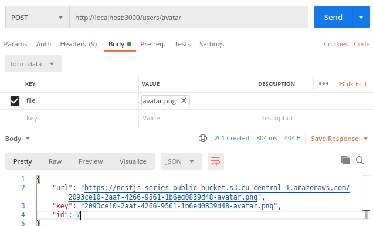
</div>

That's is all the setup to use Public bucket service of AWS.


</details>

---

## 9.2  Private bucket AWS


<details>
<summary>Click to expand section</summary>

Check the code at branch [9-aws-private-files](https://gitlab.com/tienduy-nguyen/nestjs-flow/-/tree/9-aws-private-files)

There is quite a bit more to Amazon S3 than storing public files. In this article, we look into how we can manage private files. To do so, we learn how to set up a proper private Amazon S3 bucket and how to upload and access files. We use streams and generate presigned URLs with an expiration time.

### Setting up AWS S3

We will create new bucket as we did in the previous part. But this time, we will make private bucket. That's means we will block all public access for bucket (feature of AWS S3)

The first thing to do is to create a new bucket.

<div align="center">
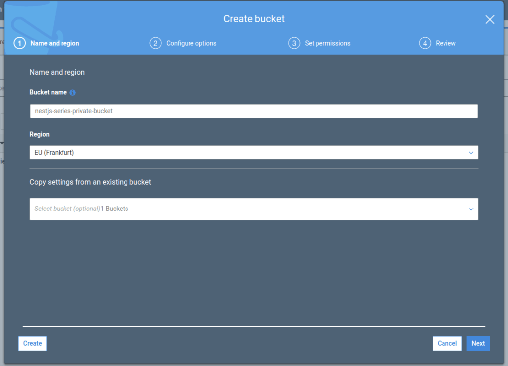
</div>


This time, we intend to restrict access to the files we upload. Every time we want our users to be able to access a file, they will need to do it through our API.

<div align="center">
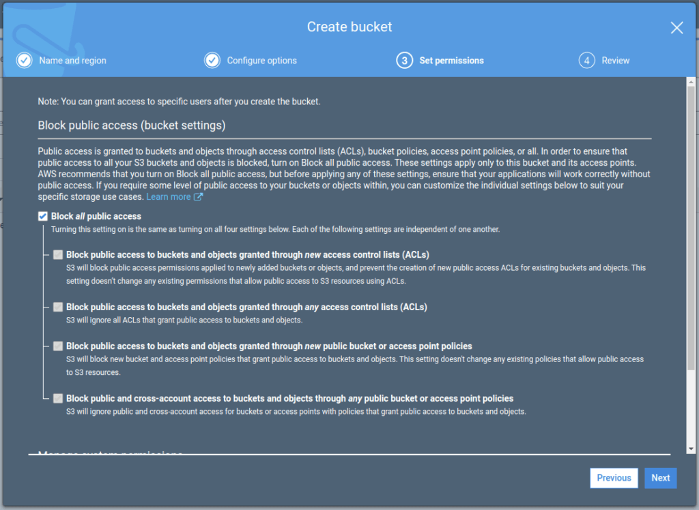
</div>

The IAM user that we’ve created in the previous part of this series has access to all our buckets. Therefore, all we need to do to start using it is to add the name of the bucket to our environment variables.

- Update `.env` file
  ```env
  # ...
  AWS_PRIVATE_BUCKET_NAME=nestjs-series-private-bucket
  ```
- Update `node.d.ts`
  ```ts
  // node.d.ts
  declare namespace NodeJS {
    interface ProcessEnv {
     // ...
      readonly AWS_PRIVATE_BUCKET_NAME: string;
    }
  }
  ```

### Update FileModule for Private bucket

- Create privateFiles entity: `src/modules/files/private-file.entity.ts`
  ```ts
  // private-file.entity.ts

  import { User } from '@modules/user/user.entity';
  import { Column, Entity, ManyToOne, PrimaryGeneratedColumn } from 'typeorm';

  @Entity()
  export class PrivateFile {
    @PrimaryGeneratedColumn('uuid')
    public id: string;

    @Column({ unique: true })
    public key: string;

    @ManyToOne(() => User, (owner: User) => owner.files)
    public owner: User;
  }

  ```
- Using **PrivateFile** in **UserEntity**
  ```ts
  // user.entity.ts
  // ...
  import { PublicFile } from '@modules/files/public-file.entity';
  import { PrivateFile } from '@modules/files/private-file.entity';

  @Entity()
  export class User {
    // ...

    @OneToMany(
      () => PrivateFile,
      (file: PrivateFile) => file.owner
    )
    public files: PrivateFile[];
  }
  ```
- Create **PrivateFileService**: `src/modules/files/services/private-files.service.ts`
  ```ts
  // private.files.service.ts

  import { HttpException, HttpStatus, Injectable } from '@nestjs/common';
  import { InjectRepository } from '@nestjs/typeorm';
  import { CreatePrivateFileDto } from '../dto/create-private-file.dto';
  import { PrivateFileRepository } from '../repositories/private-file.repository';
  import { S3Service } from './s3.service';

  @Injectable()
  export class PrivateFileService {
    constructor(
      @InjectRepository(PrivateFileRepository)
      private privateFileRepo: PrivateFileRepository,
      private s3Service: S3Service,
    ) {}
    //...

   public async uploadPrivateFile(
      ownerId: string,
      dataBuffer: Buffer,
      filename: string,
    ) {
      try {
        const uploadResult = await this.s3PrivateFileService.uploadResult(
          dataBuffer,
          filename,
        );
        const fileDto: CreatePrivateFileDto = {
          key: uploadResult.Key,
          owner: {
            id: ownerId,
          },
        };
        const newFile = await this.privateFileRepo.createPrivateFile(fileDto);
        return newFile;
      } catch (error) {
        throw new HttpException(error.message, HttpStatus.INTERNAL_SERVER_ERROR);
      }
    }

    public async uploadMultiplePrivateFile(
      ownerId: string,
      uploadFiles: UploadFileDto[],
    ) {
      try {
        const resultFiles = [];
        for (const upload of uploadFiles) {
          const uploadResult = await this.s3PrivateFileService.uploadResult(
            upload.dataBuffer,
            upload.filename,
          );
          const fileDto: CreatePrivateFileDto = {
            key: uploadResult.Key,
            owner: {
              id: ownerId,
            },
          };
          const newFile = await this.privateFileRepo.createPrivateFile(fileDto);
          resultFiles.push(newFile);
        }

        return resultFiles;
      } catch (error) {
        throw new HttpException(error.message, HttpStatus.INTERNAL_SERVER_ERROR);
      }
    }

    public async deletePrivateFile(fileId: string) {
      const file = await this.getFileById(fileId);
      try {
        const fileDto: DeletePrivateFileDto = {
          key: file.key,
        };
        await this.s3PrivateFileService.deleteFile(fileDto);

        return await this.privateFileRepo.deleteFile(fileId);
      } catch (error) {
        throw new HttpException(error.message, HttpStatus.INTERNAL_SERVER_ERROR);
      }
    }
  }

  ```
- Update **UserService**
  ```ts
  // user.service.ts
  // ...
  @Injectable()
  export class UserService {
    constructor(
      @InjectRepository(UserRepository)
      private readonly userRepository: UserRepository,
      private readonly publicFileService: PublicFileService,
      private readonly addressService: AddressService,
      private readonly privateFileService: PrivateFileService,
    ) {}

    //...
    public async addPrivateFile(
      userId: string,
      dataBuffer: Buffer,
      filename: string,
    ) {
      return await this.privateFileService.uploadPrivateFile(
        userId,
        dataBuffer,
        filename,
      );
    }

    public async addMultiplePrivateFile(
      userId: string,
      uploadFiles: UploadFileDto[],
    ) {
      return await this.privateFileService.uploadMultiplePrivateFile(
        userId,
        uploadFiles,
      );
    }
    public async deletePrivateFile(userId: string, fileId: string) {
      try {
        const canRemoveFile = await this.userRepository.canRemoveFile(
          userId,
          fileId,
        );
        if (canRemoveFile) {
          await this.privateFileService.deletePrivateFile(fileId);
          return { deleted: true };
        }
        return { deleted: false };
      } catch (error) {
        throw new HttpException(error.message, HttpStatus.INTERNAL_SERVER_ERROR);
      }
    }
  }

  ```
- Update **UserController**

  ```ts
  // user.controller.ts
    @Post('files')
    @UseGuards(JwtAuthGuard)
    @UseInterceptors(FileInterceptor('file'))
    public async addFile(@Req() req: IRequestWithUser, @UploadedFile() file) {
      const { user } = req;
      return await this.userService.addPrivateFile(
        user.id,
        file.buffer,
        file.originalname,
      );
    }

    @Post('files')
    @UseGuards(JwtAuthGuard)
    @UseInterceptors(FilesInterceptor('files', 10))
    public async addMultipleFiles(
      @Req() req: IRequestWithUser,
      @UploadedFiles() files,
    ) {
      const { user } = req;
      const uploadFiles = [] as UploadFileDto[];
      files.forEach((file) => {
        uploadFiles.push({
          dataBuffer: file.buffer,
          filename: file.originalname,
        });
      });
      return await this.userService.addMultiplePrivateFile(user.id, uploadFiles);
    }

    @Delete('files/:fileId')
    @UseGuards(JwtAuthGuard)
    public async deleteFile(
      @Req() req: IRequestWithUser,
      @Param('fileId') fileId: string,
    ) {
      return await this.userService.deletePrivateFile(req.user.id, fileId);
    }
  ```
- Test with Postman
  After doing all of the above, our users can start uploading private files.

  <div align="center">
  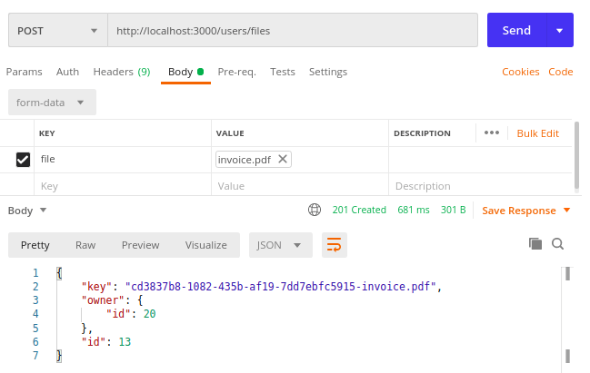
  </div>

  You can also implement deleting the files in a very similar way as in the previous part.

- Accessing private files
  Since the files we upload above are private, we can’t access them by simply entering a URL. Trying to do so will result in getting an error.

  <div align="center">
  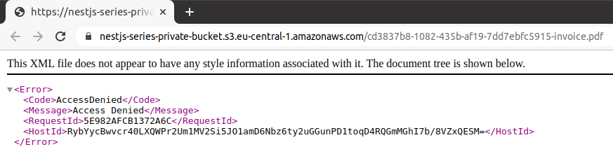
  </div>

  There is more than one way to approach this issue. Let’s start with the most straightforward one.

### Fetch files and Generating presigned URLs from AWS S3 as  a stream

The first solution to the above issue is to send the file through our API. The most fitting way to do that is to pipe a readable stream that we can get from the AWS SDK to our response. We will work directly with streams and don't need to download the file into the memory server.


The first thing to do is to get a readable stream of data from our Amazon S3 bucket.
- Update **S3PrivateFileService**: `src/modules/files/services/s3-private-file.service.ts`
  ```ts
  //...
   public async createStreamFromFile(fileKey: string) {
    return await this.s3
      .getObject({
        Bucket: this.bucketName,
        Key: fileKey,
      })
      .createReadStream();
  }

  public async generatePresignedUrl(fileKey: string) {
    const url = await this.s3.getSignedUrlPromise('getObject', {
      Bucket: this.bucketName,
      Key: fileKey,
    });
    return url;
  }
  ```


- Update **PrivateFileService**: `src/modules/files/services/private-file.service.ts`
  ```ts
  // private-file.service.ts
  // ...
  public async getPrivateFileFromAWS(fileId: string) {
    const file = await this.getFileById(fileId);
    try {
      const stream = await this.s3PrivateFileService.createStreamFromFile(
        file.key,
      );
      return {
        stream,
        info: file,
      };
    } catch (error) {
      throw new HttpException(error.message, HttpStatus.INTERNAL_SERVER_ERROR);
    }
  }

  public async generatePresignedUrl(fileKey: string) {
    try {
      return await this.s3PrivateFileService.generatePresignedUrl(fileKey);
    } catch (error) {
      throw new HttpException(error.message, HttpStatus.INTERNAL_SERVER_ERROR);
    }
  }

  ```

Now we need to make sure if the users should be able to download the file.
- Update **UserService**: `src/modules/user/user.service.ts`
  ```ts
  // user.service.ts
   public async getPrivateFileFromAWS(userId: string, fileId: string) {
    try {
      const file = await this.privateFileService.getPrivateFileFromAWS(fileId);
      if (file.info.owner.id === userId) {
        return file;
      }
      throw new UnauthorizedException();
    } catch (error) {
      if (error.status) {
        throw error;
      }
      throw new HttpException(error.message, HttpStatus.UNAUTHORIZED);
    }
  }

  public async getAllPrivatesFileFromAWS(userId: string) {
    try {
      const userWithFiles = await this.userRepository.getUserWithFilesById(
        userId,
      );
      if (!userWithFiles) {
        throw new NotFoundException('User not found');
      }
      return Promise.all(
        userWithFiles.files.map(async (file) => {
          const url = await this.privateFileService.generatePresignedUrl(
            file.key,
          );
          return {
            ...file,
            url,
          };
        }),
      );
    } catch (error) {
      if (error.status) {
        throw error;
      }
      throw new HttpException(error.message, HttpStatus.INTERNAL_SERVER_ERROR);
    }
  }
  ```
- Update **UserController**
  ```ts
  // user.service.ts
  // ...
  @Get('files/:fileId')
  @UseGuards(JwtAuthGuard)
  public async getUserPrivateFileFromAWS(
    @Req() req: IRequestWithUser,
    @Param('fileId') fileId: string,
  ) {
    const file = await this.userService.getPrivateFileFromAWS(
      req.user.id,
      fileId,
    );
    file.stream.pipe(req.res);
  }

  @Get('files')
  @UseGuards(JwtAuthGuard)
  public async getAllUserFilesFromAWS(@Req() req: IRequestWithUser) {
    return await this.userService.getAllPrivatesFileFromAWS(req.user.id);
  }
  ```

Now, the user can access all of the files in a very straightforward way.

<div align="center">

</div>

</details>

---


## 10. Elasticsearch

<details>
<summary>Click to expand section</summary>

Check the code at branch [10-elasticsearch](https://gitlab.com/tienduy-nguyen/nestjs-flow/-/tree/10-elasticsearch)


Elasticsearch is a distributed, RESTful search and analytics engine capable of addressing a growing number of use cases.

Elastic search is just a really, really fast RESTful search and analytics engine which can interface with various programming languages.

Let's start:

Check awesome article about this part at [wanago-nestjs-elasticsearch](https://wanago.io/2020/09/07/api-nestjs-elasticsearch/)

**Missing docs for this part. Working in progress....**

</details>

---

## 11. Refresh token

<details>
<summary>Click to expand section</summary>

Check the code at branch [11-refresh-token](https://gitlab.com/tienduy-nguyen/nestjs-flow/-/tree/11-refresh-token)


Check awesome article about this part at [wanago-nestjs-refresh-token](https://wanago.io/2020/09/21/api-nestjs-refresh-tokens-jwt/)

- **Why do we need refresh tokens?**

  So far, we’ve implemented JWT access tokens. They have a specific expiration time that should be short. If someone steals it from our user, the token is usable just until it expires.

  After the user logs in successfully, we send back the access token. Let’s say that it has an expiry of 15 minutes. During this period, it can be used by the user to authenticate while making various requests to our API.

  After the expiry time passes, the user needs to log in by again providing the username and password. This does not create the best user experience, unfortunately. On the other hand, increasing the expiry time of our access token might make our API less secure.

  The solution to the above issue might be refresh tokens. The basic idea is that on a successful log-in, we create two separate JWT tokens. One is an access token that is valid for 15 minutes. The other one is a refresh token that has an expiry of a week, for example.


- **How refresh tokens work**
  The user saves both of the tokens in cookies but uses just the access token to authenticate while making requests. It works for 15 minutes without issues. Once the API states that the access token expires, the user needs to perform a refresh.

  The crucial thing about storing tokens in cookies is that they should use the httpOnly flag. For more information, check out Cookies: [explaining document.cookie and the Set-Cookie header](https://wanago.io/2018/06/18/cookies-explaining-document-cookie-and-the-set-cookie-header/)

  To refresh the token, the user needs to call a separate endpoint, called  /refresh. This time, the refresh token is taken from the cookies and sent to the API. If it is valid and not expired, the user receives the new access token. Thanks to that, there is no need to provide the username and password again.


- **Addressing some of the potential issues**

  Unfortunately, we need to consider the situation in which the refresh token is stolen. It is quite a sensitive piece of data, almost as much as the password.

  We need to deal with the above issue in some way. The most straightforward way of doing so is changing the JWT secret once we know about the data leak. Doing that would render all of our refresh tokens invalid, and therefore, unusable.

  We might not want to log out every user from our application, though. Assuming we know the affected user, we would like to make just one refresh token invalid. JWT is in its core stateless, though.

  One of the solutions that we might stumble upon while browsing the web is a blacklist. Every time someone uses a refresh token, we check if it is in the blacklist first. Unfortunately, this does not seem like a solution that would have good enough performance. Checking the blacklist upon every token refresh and keeping it up-to-date might be a demanding task.

  An alternative is saving the current refresh token in the database upon logging in. When someone performs a refresh, we check if the token kept in the database matches the provided one. If it is not the case, we reject the request. Thanks to doing the above, we can easily make the token of a particular person invalid by removing it from the database.

- **Logging out**

  So far, when the user logged out, we’ve just removed the JWT token from cookies. While this might be a viable solution for tokens with a short expiry time, it creates some issues with refresh tokens. Even though we removed the refresh token from the browser, it is still valid for a long time.

  We can address the above issue by removing the refresh token from the database once the user logs out. If someone tries to use the refresh token before it expires, it is not possible anymore.

- **Preventing logging in on multiple devices**

  Let’s assume that we provide services that require a monthly payment. Allowing many people to use the same account at the same time might have a negative impact on our business.

  Saving the refresh token upon logging in can help us deal with the above issue too. If someone uses the same user credentials successfully, it overwrites the refresh token stored in the database. Thanks to doing that, the previous person is not able to use the old refresh token anymore.


- **A potential database leak**

  We’ve mentioned that the refresh token is sensitive data. If it leaks out, the attacker can easily impersonate our user.

  We have a similar case with the passwords. This is why we keep hashes of the passwords instead of just plain text. We can improve our refresh token solution similarly.

  If we hash our refresh tokens before saving them in the database, we prevent the attacker from using them even if our database is leaked.

Now we start to implement **JWT refresh token in Nestjs**

### Implementation in Nestjs

- Add new variables environment:
  ```env
  # .env
  JWT_REFRESH_TOKEN_SECRET=somesecretforjwtrefreshtoken
  # 30d
  JWT_REFRESH_TOKEN_EXPIRATION_TIME= 2592000
  ```

  And update in `node.d.ts`
  ```ts
  declare namespace NodeJS {
    interface ProcessEnv {
      // ...
      readonly JWT_REFRESH_TOKEN_SECRET: string;
      readonly JWT_REFRESH_TOKEN_EXPIRATION_TIME: string;
    }
  }
  ```
- Create new column for **UserEntity** to stock a **refresh token code** encrypted
  ```diff
  + @Column({
  +    nullable: true,
  +  })
  +  @Exclude()
  +  public currentHashedRefreshToken?: string;
  ```
- We also need to create a function for creating a method for creating a cookie with the refresh token and method to save the hash of the current refresh token. We will update in `auth.service.ts`

  ```ts
  // auth.service.ts
  // Method to get access token cookie
   public getCookieWithToken(payload: IPayloadJwt) {
    const token = this.jwtService.sign(payload, {
      secret: process.env.JWT_SECRET,
      expiresIn: `${process.env.JWT_EXPIRATION_TIME}s`,
    });
    return `Authorization=${token};HttpOnly;Path=/;Max-Age=${process.env.JWT_EXPIRATION_TIME}`;
  }

  // Method to get refresh token cookie
  public getCookieWithJwtRefreshToken(payload: IPayloadJwt) {
    const token = this.jwtService.sign(payload, {
      secret: process.env.JWT_REFRESH_TOKEN_SECRET,
      expiresIn: `${process.env.JWT_REFRESH_TOKEN_EXPIRATION_TIME}s`,
    });
    const cookie = `Refresh=${token}; HttpOnly; Path=/; Max-Age=${process.env.JWT_REFRESH_TOKEN_EXPIRATION_TIME}`;
    return {
      cookie,
      token,
    };
  }


  ```

  We need create some methods helpers for `AuthService` to create in `auth.repository.ts`:
  ```ts
  // auth.repository.ts
    public async updateRefreshToken(
    user: User,
    currentHashedRefreshToken: string,
  ) {
    await this.save({
      ...user,
      currentHashedRefreshToken: currentHashedRefreshToken,
    });
    return user;
  }


  ```
- Let’s make sure that we send both cookies when logging in.
  Update `auth.controller`:
  ```ts
  @Post('login')
  @UseGuards(LocalAuthGuard)
  public async login(@Req() req: IRequestWithUser) {
    const { user } = req;
    const payload: IPayloadJwt = {
      userId: user.id,
      email: user.email,
    };
    const accessTokenCookie = this.authService.getCookieWithToken(payload);
    const {
      cookie: refreshTokenCookie,
      token: refreshToken,
    } = this.authService.getCookieWithJwtRefreshToken(payload);
    await this.authService.setCurrentRefreshToken(user, refreshToken);
    this.authService.setHeaderArray(req.res, [
      accessTokenCookie,
      refreshTokenCookie,
    ]);
    return user;
  }
  ```
### Creating an endpoint that uses the refresh token

Now we can start handling the incoming refresh token. For starters, let’s deal with checking if the token from cookies matches the one in the database.

- Create method retrieve **user** from **refresh token** in `auth.service.ts`

  ```ts
  // auth.service.ts
   public async setCurrentRefreshToken(
    user: User,
    refreshToken: string,
  ): Promise<User> {
    const salt = await bcrypt.genSalt(10);
    const currentHashedRefreshToken = await bcrypt.hash(refreshToken, salt);

    return await this.authRepository.updateRefreshToken(
      user,
      currentHashedRefreshToken,
    );
  }
  ```

  And method helper from `auth.repository.ts`
  ```ts
  // auth.repository.ts
    // Get user with from refresh token
  public async getUserIfRefreshTokenMatches(
    refreshToken: string,
    userId: string,
  ) {
    const user = await this.getUserById(userId);

    const isRefreshTokenMatching = await bcrypt.compare(
      refreshToken,
      user.currentHashedRefreshToken,
    );
    if (isRefreshTokenMatching) return user;
    return null;
  }
  public setHeaderSingle(res: Response, cookie: string): void {
    res.setHeader('Set-Cookie', cookie);
  }
  public setHeaderArray(res: Response, cookies: string[]): void {
    res.setHeader('Set-Cookie', cookies);
  }
  ```
- Create new strategy `jwt-refresh-token` from PassportStrategy
  Create new file `src/modules/auth/strategies/jwt-refresh-token.strategy.ts`
  ```ts
  // jwt-refresh-token.strategy.ts
  import { IPayloadJwt } from '../auth.interface';
  import { Injectable } from '@nestjs/common';
  import { ExtractJwt, Strategy } from 'passport-jwt';
  import { PassportStrategy } from '@nestjs/passport';
  import { Request } from 'express';
  import { InjectRepository } from '@nestjs/typeorm';
  import { AuthRepository } from '../auth.repository';

  @Injectable()
  export class JwtRefreshTokenStrategy extends PassportStrategy(
    Strategy,
    'jwt-refresh-token',
  ) {
    constructor(
      @InjectRepository(AuthRepository)
      private readonly authRepository: AuthRepository,
    ) {
      super({
        jwtFromRequest: ExtractJwt.fromExtractors([
          (req: Request) => {
            return req?.cookies?.Refresh;
          },
        ]),
        ignoreExpiration: false,
        secretOrKey: process.env.JWT_REFRESH_TOKEN_SECRET,
        passReqToCallback: true,
      });
    }
    public async validate(req: Request, payload: IPayloadJwt) {
      const refreshToken = req.cookies?.Refresh;
      return this.authRepository.getUserIfRefreshTokenMatches(
        refreshToken,
        payload.userId,
      );
    }
  }

  ```
  **Note**: We use the name `jwt-refresh-token` for the name of guard. And Please note that we use the  passReqToCallback parameter so that we can access the cookies in our  validate method.

- Create new guard : `src/modules/auth/guards/jwt-refresh-token.guard.ts`
  ```ts
  // jwt-refresh-token.guard.ts
  import { Injectable } from '@nestjs/common';
  import { AuthGuard } from '@nestjs/passport';

  @Injectable()
  export class JwtRefreshTokenAuthGuard extends AuthGuard('jwt-refresh-token') {}

  ```

- Update **JwtRefreshTokenStrategy** in **AuthModule**
  ```ts
  // auth.module.ts
  // ...
  @Module({
    imports: [
      ConfigModule.forRoot(),
      TypeOrmModule.forFeature([AuthRepository]),
      PassportModule,
      JwtModule.register({}),
    ],
    providers: [AuthService, LocalStrategy, JwtStrategy, JwtRefreshTokenStrategy],
    exports: [AuthService],
    controllers: [AuthController],
  })
  export class AuthModule {}

  ```
- Now, the last thing to do is to create the  `/refresh` endpoint in `AuthController`
  ```ts
  // auth.controller.ts
  // ...
  @UseGuards(JwtRefreshTokenAuthGuard)
  @Get('refresh')
  public refresh(@Req() req: IRequestWithUser) {
    const { user } = req;
    const payload: IPayloadJwt = {
      userId: user.id,
      email: user.email,
    };
    const accessTokenCookie = this.authService.getCookieWithToken(payload);
    this.authService.setHeaderSingle(req.res, accessTokenCookie);
    return req.user;
  }
  ```
  **Note**: Please make sure we use `@UseGuards(JwtRefreshTokenAuthGuard)`

  We will make request this endpoint in front-end side.

### Improving the log-out flow

- Update methods in `src/modules/auth/auth.service.ts`
  ```ts
  // auth.service.ts
  public async removeRefreshToken(user: User): Promise<User> {
    return await this.authRepository.clearRefreshToken(user);
  }

  public clearCookie(res: Response): void {
    const emptyCookie = [
      'Authentication=; HttpOnly; Path=/; Max-Age=0',
      'Refresh=; HttpOnly; Path=/; Max-Age=0',
    ];
    res.setHeader('Set-Cookie', emptyCookie);
  }

  ```
- Use theses methods in our **AuthController**
  ```ts
  // auth.controller.ts
  @Post('logout')
  @UseGuards(JwtAuthGuard)
  public async logout(@Req() req: IRequestWithUser) {
    const { user } = req;
    await this.authService.removeRefreshToken(user);
    this.authService.clearCookie(req.res);
    return {
      logout: true,
    };
  }
  ```


</details>

---

## 12. Improve performance of databases

<details>
<summary>Click to expand section</summary>

Check the code at branch [12-database-indexes](https://gitlab.com/tienduy-nguyen/nestjs-flow/-/tree/12-database-indexes)

Check awesome article of Wanago at:

- [Improving performance of our Postgres database with indexes](https://wanago.io/2020/10/19/nestjs-performance-postgres-database-indexes/)
- [Transaction in Postgres and Typeorm](https://wanago.io/2020/10/26/api-nestjs-transactions-postgresql-typeorm/)
- [Using array data type in Postgres](https://wanago.io/2020/11/02/api-nestjs-array-data-type-postgresql-typeorm/)
- [Pagination for entity](https://wanago.io/2020/11/09/api-nestjs-offset-keyset-pagination-postgresql-typeorm/)

**Missing docs for this part. Working in progress....**

</details>

---

## 13. Nestjs microservices

<details>
<summary>Click to expand section</summary>

Check the code at branch [13-microservice](https://gitlab.com/tienduy-nguyen/nestjs-flow/-/tree/13-microservice)
Check the code at branch [13-microservice-grpc](https://gitlab.com/tienduy-nguyen/nestjs-flow/-/tree/13-microservice-grpc)

Project microservice found at [nest-email-subscription](https://gitlab.com/tienduy-nguyen/nestjs-demo/-/tree/master/nestjs-microservice)

Check awesome articles of Marcin Wanago at:
- [Exploring the idea of microservice](https://wanago.io/2020/11/16/api-nestjs-microservices/)
- [Using RabbitMQ to communicate with microservices](https://wanago.io/2020/11/23/api-nestjs-rabbitmq-microservices/)
- [Using gRPC framework to comunicate microservices](https://wanago.io/2020/11/30/api-nestjs-microservices-grpc-framework/)

**Missing docs for this part. Working in progress....**

</details>

---


## 14. Command Query Responsibility Segregation (CQRS Pattern)

<details>
<summary>Click to expand section</summary>

Check the code at branch [10-elasticsearch](https://gitlab.com/tienduy-nguyen/nestjs-flow/-/tree/10-elasticsearch)

Check awesome article of Wanago at [Improving performance of our Postgres database with indexes](https://wanago.io/2020/10/19/nestjs-performance-postgres-database-indexes/)

**Missing docs for this part. Working in progress....**

</details>

---


## 15.

<details>
<summary>Click to expand section</summary>

Check the code at branch [10-elasticsearch](https://gitlab.com/tienduy-nguyen/nestjs-flow/-/tree/10-elasticsearch)

Check awesome article of Wanago at [Improving performance of our Postgres database with indexes](https://wanago.io/2020/10/19/nestjs-performance-postgres-database-indexes/)

**Missing docs for this part. Working in progress....**

</details>

---


## 16.

<details>
<summary>Click to expand section</summary>

Check the code at branch [10-elasticsearch](https://gitlab.com/tienduy-nguyen/nestjs-flow/-/tree/10-elasticsearch)

Check awesome article of wanago at [Improving performance of our Postgres database with indexes](https://wanago.io/2020/10/19/nestjs-performance-postgres-database-indexes/)

**Missing docs for this part. Working in progress....**

</details>

---


## References

- [Docs NestJs](https://docs.nestjs.com/)
- Thanks [Wanago](https://wanago.io/) to awesome of [series NestJS](https://github.com/mwanago/nestjs-typescript)
